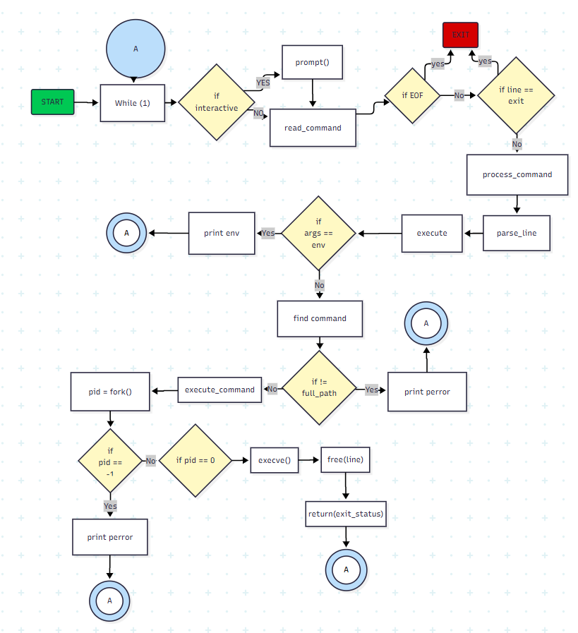
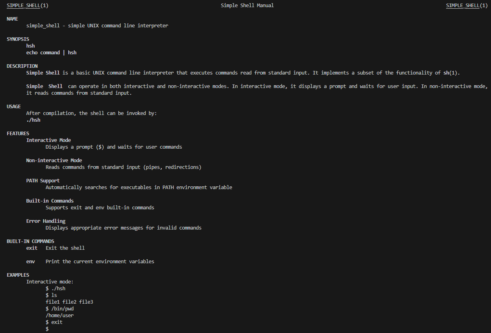
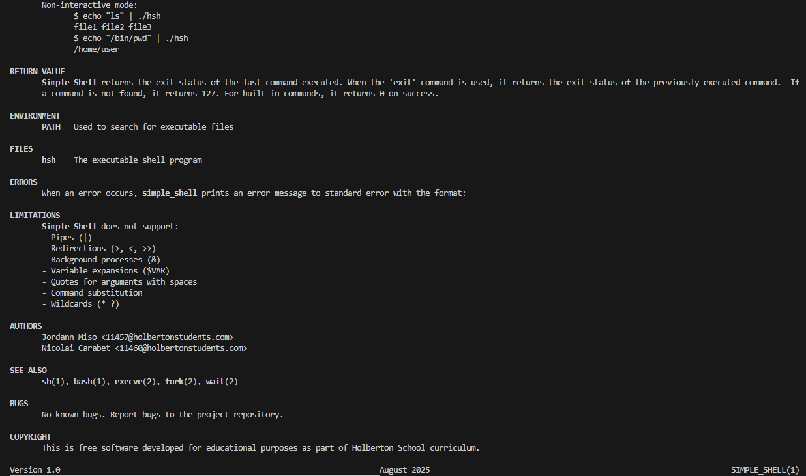

# Simple Shell



## Description

Simple Shell est un interpréteur de commandes Unix basique développé en C qui reproduit certaines fonctionnalités du shell `/bin/sh`. Ce projet implémente un shell minimal capable d'exécuter des commandes, gérer les variables d'environnement et inclure des commandes intégrées essentielles.

Le shell fonctionne en mode interactif et non-interactif, permettant l'exécution de commandes simples avec arguments, la recherche automatique dans le PATH et la gestion appropriée des erreurs et de la mémoire.

## Requirements

### Compilateur
- **GCC** (GNU Compiler Collection)
- Compatible avec les standards **C89/C90**

### Fonctions autorisées
- `access` (man 2 access)
- `chdir` (man 2 chdir)
- `close` (man 2 close)
- `closedir` (man 3 closedir)
- `execve` (man 2 execve)
- `exit` (man 3 exit)
- `_exit` (man 2 _exit)
- `fflush` (man 3 fflush)
- `fork` (man 2 fork)
- `free` (man 3 free)
- `getcwd` (man 3 getcwd)
- `getline` (man 3 getline)
- `getpid` (man 2 getpid)
- `isatty` (man 3 isatty)
- `kill` (man 2 kill)
- `malloc` (man 3 malloc)
- `open` (man 2 open)
- `opendir` (man 3 opendir)
- `perror` (man 3 perror)
- `read` (man 2 read)
- `readdir` (man 3 readdir)
- `signal` (man 2 signal)
- `stat` (__xstat) (man 2 stat)
- `lstat` (__lxstat) (man 2 lstat)
- `fstat` (__fxstat) (man 2 fstat)
- `strtok` (man 3 strtok)
- `wait` (man 2 wait)
- `waitpid` (man 2 waitpid)
- `wait3` (man 2 wait3)
- `wait4` (man 2 wait4)
- `write` (man 2 write)

## Compilation

```bash
gcc -Wall -Werror -Wextra -pedantic -std=gnu89 *.c -o hsh
```

## Return Value

Le shell retourne :
- **0** : Exécution réussie ou commande `exit` sans argument
- **Code d'erreur** : Code de sortie de la dernière commande exécutée (transmis lors de l'exit)
- **127** : Commande non trouvée
- **126** : Commande trouvée mais non exécutable
- **2** : Mauvaise utilisation de commande intégrée ou erreur système

## Examples

### Mode interactif

```bash
$ ./hsh
($) /bin/ls
hsh main.c shell.c
($) ls -l
total 28
-rwxrwxr-x 1 vagrant vagrant 8984 Dec  7 13:28 hsh
-rw-rw-r-- 1 vagrant vagrant 1365 Dec  7 13:28 main.c
-rw-rw-r-- 1 vagrant vagrant 1095 Dec  7 13:28 shell.c
($) ls -la /tmp
total 12
drwxrwxrwt  7 root root 4096 Dec  7 20:12 .
drwxr-xr-x 24 root root 4096 Dec  7 20:03 ..
($) exit
$
```

### Mode non-interactif

```bash
$ echo "/bin/ls" | ./hsh
hsh shell.c execute.c parse.c
$ echo "ls -l" | ./hsh
total 28
-rwxrwxr-x 1 vagrant vagrant 8984 Dec  7 13:28 hsh
-rw-rw-r-- 1 vagrant vagrant 1365 Dec  7 13:28 shell.c
-rw-rw-r-- 1 vagrant vagrant 1095 Dec  7 13:28 execute.c
$
```

### Avec des pipes

```bash
$ echo "ls /tmp" | ./hsh
file1 file2 file3
$ echo "ls -la /tmp" | ./hsh
total 12
drwxrwxrwt  7 root root 4096 Dec  7 20:12 .
drwxr-xr-x 24 root root 4096 Dec  7 20:03 ..
-rw-rw-r-- 1 vagrant vagrant    0 Dec  7 20:12 file1
-rw-rw-r-- 1 vagrant vagrant    0 Dec  7 20:12 file2
-rw-rw-r-- 1 vagrant vagrant    0 Dec  7 20:12 file3
$ cat test_file | ./hsh
($) ls
file1 file2
($) exit
$
```

## Architecture et Flowchart

Le projet Simple Shell suit une architecture modulaire bien structurée. Voici le diagramme de flux qui illustre le fonctionnement complet du shell :


Ce flowchart montre :
- **Le flux principal d'exécution** : De la lecture de l'entrée à l'exécution des commandes
- **La gestion des erreurs** : Comment le shell traite les différents types d'erreurs
- **Les processus de parsing** : Comment les commandes sont analysées et préparées
- **L'exécution des commandes** : Le cycle fork/exec/wait
- **La gestion de la mémoire** : Allocation et libération des ressources

## Man Page

Le manuel d'utilisation complet est disponible et fournit toutes les informations détaillées sur l'utilisation du shell.

### Consultation du manuel

Pour consulter le manuel d'utilisation :

```bash
man ./man_1_simple_shell
```

ou

```bash
man -l man_1_simple_shell
```

### Aperçu du manuel

Voici un aperçu du manuel de notre Simple Shell :

**Partie 1 : En-tête et description**


**Partie 2 : Exemples et détails techniques**


Le manuel contient :
- **NAME** : Description courte du programme
- **SYNOPSIS** : Syntaxe d'utilisation
- **DESCRIPTION** : Fonctionnalités détaillées
- **USAGE** : Instructions de compilation et d'exécution
- **FEATURES** : Liste des fonctionnalités supportées
- **BUILT-IN COMMANDS** : Commandes intégrées (exit, env)
- **EXAMPLES** : Exemples d'utilisation en mode interactif et non-interactif
- **RETURN VALUE** : Codes de retour possibles
- **ENVIRONMENT** : Variables d'environnement utilisées
- **LIMITATIONS** : Fonctionnalités non supportées
- **AUTHORS** : Informations sur les développeurs

## Documentation visuelle

Ce projet comprend une documentation visuelle complète :

### 📊 Diagrammes techniques
- **[Flowchart complet](./IMG/Flowchart.png)** : Architecture et flux d'exécution détaillé
- Processus de parsing et d'exécution des commandes
- Gestion des erreurs et codes de retour
- Cycle de vie des processus (fork/exec/wait)

### 📖 Manuel d'utilisation
- **[Manuel partie 1](./IMG/Man_page_part1.png)** : Description et syntaxe
- **[Manuel partie 2](./IMG/Man_page_part2.png)** : Exemples et spécifications techniques

### 🎯 Navigation rapide
- [Voir le flowchart détaillé](#architecture-et-flowchart)
- [Consulter le manuel complet](#man-page)
- [Tester les exemples](#examples)

## Memory Leak Check

Pour vérifier les fuites mémoire avec Valgrind :

### Installation de Valgrind (si nécessaire)
```bash
sudo apt-get install valgrind
```

### Vérification des fuites mémoire

#### Mode interactif
```bash
valgrind --leak-check=full --show-leak-kinds=all --track-origins=yes ./hsh
```

#### Mode non-interactif
```bash
echo "ls -la" | valgrind --leak-check=full --show-leak-kinds=all --track-origins=yes ./hsh
```

#### Analyse détaillée
```bash
valgrind --tool=memcheck --leak-check=full --track-origins=yes --show-reachable=yes ./hsh
```

## Bugs

### Fuites mémoire connues
- **Aucune fuite mémoire détectée** : Le shell libère correctement toute la mémoire allouée
- Toutes les allocations avec `malloc()` sont accompagnées d'un `free()` approprié
- Les descripteurs de fichiers sont correctement fermés
- Les processus enfants sont correctement attendus avec `wait()`

### Limitations
- Ne supporte pas les redirections (`>`, `<`, `>>`)
- Ne supporte pas les pipes (`|`)
- Ne supporte pas les commandes en arrière-plan (`&`)
- Ne supporte pas l'expansion des variables (`$VAR`)
- Ne supporte pas les guillemets pour les arguments avec espaces
- La longueur maximale des commandes est limitée par `getline()`

### Problèmes connus
Si des fuites mémoire sont détectées lors de l'utilisation de Valgrind, elles seront listées ici avec leur cause et leur résolution.

## Authors

Voir le fichier `AUTHORS` pour la liste complète des contributeurs.
